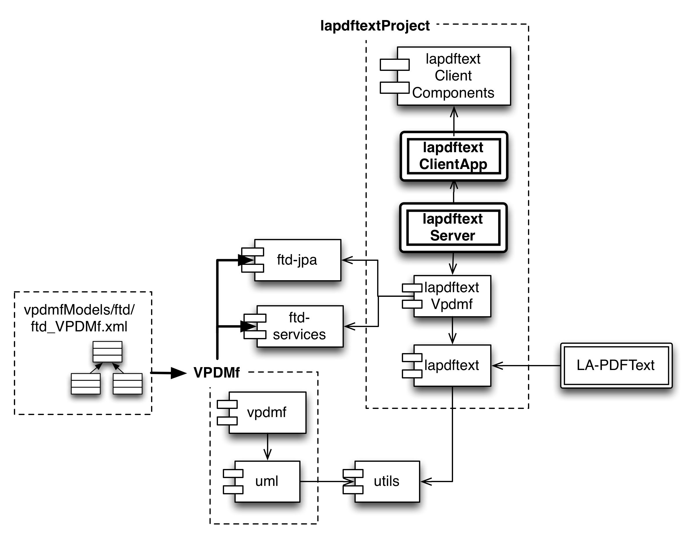

lapdftextProject
================

High-level build project for all LAPDF-Text submodules

We list five submodules in this high-level repo (six, if you include the bmkeg-parent project 
which is needed to keep track of version numbers of Maven dependencies). 
The primary point of contact for applications is either 
(A) the [lapdftext](https://github.com/BMKEG/lapdftext) library, which is the base level
library containing all functionality for directly interacting with PDF files through the 
use of the JPedal GPL open source library (Beta level of development) and 
(B) the [lapdftextServer](https://github.com/BMKEG/lapdftextServer) web application 
that provides an web-based interface for developing rule files (Alpha level of development).

We will further develop this system as a subcomponent of our digital library and knowledge engineering toolsets. 
Watch this space! 
